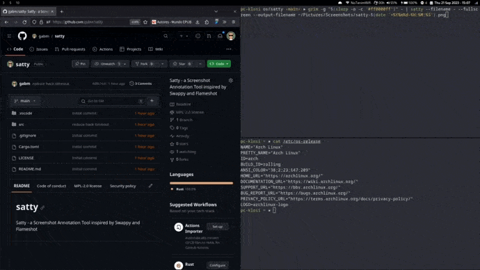

#  Satty: Modern Screenshot Annotation.

Satty is a screenshot annotation tool inspired by [Swappy](https://github.com/jtheoof/swappy) and [Flameshot](https://flameshot.org/).



Satty has been created to provide the following improvements over existing screenshot annotation tools:

- very simple and easy to understand toolset (like Swappy)
- fullscreen annotation mode and post shot cropping (like Flameshot)
- extremely smooth rendering thanks to HW acceleration (OpenGL)
- working on wlroots based compositors (Sway, Hyprland, River, ...)
- minimal, modern looking UI, thanks to GTK and Adwaita
- be a playground for new features (post window selection, post paint editing, ...)

## Install

Thanks to our package maintainers, Satty is available for many distributions on Linux and BSD:

[](https://repology.org/project/satty/versions)

### Arch Linux

You can get the official Arch Linux package from the AUR:

```
yay -S satty-bin
```

### Gentoo

You can get the Gentoo package from the Guru overlay:

```
eselect repository enable guru
emerge --sync guru
emerge -av satty
```

Pending PR for Gentoo overlay: https://github.com/gentoo/gentoo/pull/33908

### Alpine Linux

Satty is available in [Alpine Testing](https://pkgs.alpinelinux.org/packages?name=satty&branch=edge&repo=&arch=&maintainer=). You can install it by uncommenting the testing repo in `/etc/apk/repositories` and then run:

```
apk add satty
```

### Prebuilt Sources

You can download a prebuilt binary for x86-64 on the [Satty Releases](https://github.com/gabm/satty/releases) page.

## Usage

Start by providing a filename or a screenshot via stdin and annotate using the available tools. Save to clipboard or file when finished. Tools and Interface have been kept simple.

All configuration is done either at the config file in `XDG_CONFIG_DIR/.config/satty/config.toml` or via the command line interface. In case both are specified, the command line options always override the configuration file.

### Configuration File

```toml
[general]
# Start Satty in fullscreen mode
fullscreen = true
# Exit directly after copy/save action
early-exit = true
# Select the tool on startup [possible values: pointer, crop, line, arrow, rectangle, text, marker, blur, brush]
initial-tool = "brush"
# Configure the command to be called on copy, for example `wl-copy`
copy-command = "wl-copy"
# Increase or decrease the size of the annotations
annotation-size-factor = 2
# Filename to use for saving action. Omit to disable saving to file. Might contain format specifiers: https://docs.rs/chrono/latest/chrono/format/strftime/index.html
output-filename = "/tmp/test-%Y-%m-%d_%H:%M:%S.png"
# After copying the screenshot, save it to a file as well
save-after-copy = false
# Hide toolbars by default
default-hide-toolbars = false
# Whether to set block or line/pen as the default highlighter, other mode is accessible using CTRL.
default-block-highlight = true

# Font to use for text annotations
[font]
family = "Roboto"
style = "Bold"

# custom colours for the colour palette
[color-palette]
first= "#00ffff"
second= "#a52a2a"
third= "#dc143c"
fourth= "#ff1493"
fifth= "#ffd700"
custom= "#008000"
```

### Command Line

```sh
» satty --help
Modern Screenshot Annotation. A Screenshot Annotation Tool inspired by Swappy and Flameshot.

Usage: satty [OPTIONS] --filename <FILENAME>

Options:
  -c, --config <CONFIG>
          Path to the config file. Otherwise will be read from XDG_CONFIG_DIR/satty/config.toml
  -f, --filename <FILENAME>
          Path to input image or '-' to read from stdin
      --fullscreen
          Start Satty in fullscreen mode
      --output-filename <OUTPUT_FILENAME>
          Filename to use for saving action. Omit to disable saving to file. Might contain format specifiers: <https://docs.rs/chrono/latest/chrono/format/strftime/index.html>
      --early-exit
          Exit directly after copy/save action
      --initial-tool <TOOL>
          Select the tool on startup [aliases: init-tool] [possible values: pointer, crop, line, arrow, rectangle, text, marker, blur, brush]
      --copy-command <COPY_COMMAND>
          Configure the command to be called on copy, for example `wl-copy`
      --annotation-size-factor <ANNOTATION_SIZE_FACTOR>
          Increase or decrease the size of the annotations
      --save-after-copy
          After copying the screenshot, save it to a file as well
  -d, --default-hide-toolbars
          Hide toolbars by default
      --default-line-highlight
          Change the default highlighter to the line/pen highlighter
      --font-family <FONT_FAMILY>
          Font family to use for text annotations
      --font-style <FONT_STYLE>
          Font style to use for text annotations
  -h, --help
          Print help
  -V, --version
          Print version
```

### wlroots based compositors (Sway, Hyprland, Wayfire, River, ...)

You can bind a key to the following command:

```
grim -g "$(slurp -o -r -c '#ff0000ff')" - | satty --filename - --fullscreen --output-filename ~/Pictures/Screenshots/satty-$(date '+%Y%m%d-%H:%M:%S').png
```

## Build from source

You first need to install the native dependencies of Satty (see below) and then run:

```sh
# build release binary, located in ./target/release/satty
make build-release

# optional: install to /usr/local
PREFIX=/usr/local make install

# optional: uninstall from /usr/local
PREFIX=/usr/local make uninstall
```

## Dependencies

Satty is based on GTK-4 and Adwaita.

### Ubuntu

- libgtk-4-1
- libadwaita-1-0
- libepoxy
- fontconfig

### Arch Linux & Gentoo

- glib2
- libadwaita
- gtk4
- gdk-pixbuf2
- libepoxy
- fontconfig

## License

The source code is released under the MPL-2.0 license.

The Font 'Roboto Regular' from Google is released under Apache-2.0 license.
